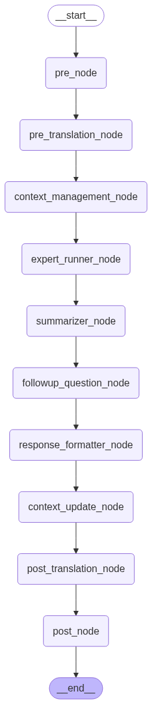
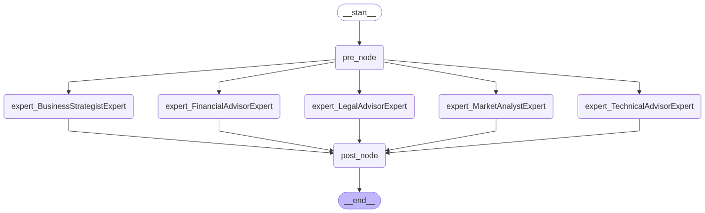

# Anna AI Coach - Multi-Agent Framework

## 🎯 Overview

**Anna AI Coach** is a sophisticated framework-level design for solving large, complex, multi-agent problems in a standardized way. This framework provides a robust architecture for orchestrating multiple AI experts to collaboratively address complex business, technical, and strategic challenges.

### 🏗️ Framework Architecture

The system is built on a three-tier architecture that ensures scalability, maintainability, and extensibility:

```
┌─────────────────┐    ┌─────────────────┐    ┌─────────────────┐
│     Manager     │    │    Resources    │    │     Experts     │
│                 │    │                 │    │                 │
│ • Workflow      │◄──►│ • LLM Service   │◄──►│ • Business      │
│ • Expert Runner │    │ • Logging       │    │ • Financial     │
│ • State Mgmt    │    │ • Context       │    │ • Legal         │
│ • Orchestration │    │ • Data Sources  │    │ • Technical     │
└─────────────────┘    └─────────────────┘    └─────────────────┘
```

## 🧠 Core Concepts

### 1. **Manager Layer** - The Orchestrator
The manager acts as the central nervous system of the framework, handling all expert coordination and workflow execution.

**Real-life Example**: Think of a **hospital emergency room** where the **chief resident** (Manager) coordinates multiple specialists (Experts) - cardiologists, neurologists, trauma surgeons - each with their own expertise, to treat a complex patient case.

**Key Responsibilities**:
- **Workflow Orchestration**: Manages the entire request processing pipeline
- **Expert Coordination**: Dynamically assigns and runs relevant experts
- **State Management**: Maintains conversation context and user history
- **Parallel Execution**: Runs multiple experts simultaneously when needed

### 2. **Resource Layer** - The Shared Infrastructure
Resources provide common services and utilities used by both managers and experts.

**Real-life Example**: Like a **hospital's shared infrastructure** - the laboratory, pharmacy, medical records system, and diagnostic equipment that all departments use.

**Key Components**:
- **LLM Service**: Centralized AI model management and communication
- **Logging System**: Comprehensive logging for debugging and monitoring
- **Context Management**: User session and conversation history storage
- **Data Sources**: Extensible data access layer (embeddings, web search, databases)

### 3. **Expert Layer** - The Specialists
Experts are specialized AI agents, each with domain-specific knowledge and decision-making capabilities.

**Real-life Example**: Like **medical specialists** - each expert has deep knowledge in their field and can decide whether they should be involved in a particular case.

**Key Features**:
- **Opt-in Decision Making**: Each expert decides whether to participate based on the user's question
- **Domain Specialization**: Deep expertise in specific areas (business, finance, legal, technical)
- **Independent Operation**: Can work autonomously or collaboratively
- **Extensible Design**: Easy to add new experts with different specializations

## 🔄 System Workflow

### Main Workflow Diagram


### Expert Runner Diagram  


### Detailed Workflow Explanation

#### 1. **Pre-Processing Phase**
- **`pre_node`**: Initial request validation and preprocessing
- **`pre_translation_node`**: Language detection and translation setup if needed

#### 2. **Context Management**
- **`context_management_node`**: Retrieves user history and conversation context
- **Maintains**: User preferences, previous interactions, session data

#### 3. **Expert Execution** ⭐ **Core Innovation**
- **`expert_runner_node`**: The heart of the system
  - **Dynamic Expert Selection**: Each expert evaluates the user's question
  - **Opt-in Mechanism**: Experts decide whether to participate
  - **Parallel Execution**: Multiple experts can run simultaneously
  - **Independent Decision Making**: Each expert has autonomy

#### 4. **Response Synthesis**
- **`summarizer_node`**: Combines expert responses into coherent advice
- **`followup_question_node`**: Generates relevant follow-up questions
- **`response_formatter_node`**: Formats the final response

#### 5. **Post-Processing**
- **`context_update_node`**: Updates user context with new information
- **`post_translation_node`**: Translates response if needed
- **`post_node`**: Final response formatting and delivery

## 🎯 Expert Runner: Dynamic Expert Management

### Parallel Expert Execution
The expert runner is a **graph-based execution engine** that can dynamically add and run experts in parallel:

```python
# Example: Adding experts dynamically
experts = [
    BusinessStrategistExpert(),
    FinancialAdvisorExpert(), 
    LegalAdvisorExpert(),
    MarketAnalystExpert(),
    TechnicalAdvisorExpert()
]

# All experts run in parallel, each deciding whether to participate
```

### Opt-in Decision Making
Each expert implements an **opt-in mechanism** that determines whether they should respond to a user's question:

```python
class BaseExpert:
    def opt_in(self, user_prompt: str) -> bool:
        """
        Expert decides whether to participate based on:
        - Question relevance to their domain
        - Their expertise match
        - Current workload/capacity
        """
        # Uses LLM to make intelligent decision
        return expert_decision.make_decision(user_prompt)
```

**Real Example**:
- **User Question**: "How should I structure my startup's equity?"
- **Business Strategist**: ✅ Opts in (equity structure is business strategy)
- **Financial Advisor**: ✅ Opts in (financial implications of equity)
- **Legal Advisor**: ✅ Opts in (legal requirements and contracts)
- **Technical Advisor**: ❌ Opts out (not a technical question)
- **Market Analyst**: ❌ Opts out (not a market analysis question)

## 🔌 Extensible Data Sources

The framework supports multiple data sources that can be easily integrated:

### Available Data Sources
- **Embedding Search**: Internal knowledge base and documentation
- **Web Search**: Real-time internet information
- **Database Connections**: Structured data access
- **API Integrations**: External service connections

### Use Case Examples

**Financial Expert** might need:
- Real-time market data (web search)
- Company financial records (database)
- Regulatory information (API)

**Technical Expert** might need:
- Internal documentation (embedding search)
- Latest technology trends (web search)
- Code repositories (API)

**Business Strategist** might need:
- Industry reports (web search)
- Company performance data (database)
- Competitive intelligence (API)

## 🚀 Setup and Installation

### Prerequisites
- Python 3.8+
- Azure OpenAI account (or compatible LLM provider)
- Git

### 1. Clone the Repository
```bash
git clone https://github.com/hackdavid/intelligent-expert-orchestrator
cd intelligent-expert-orchestrator
```

### 2. Create Virtual Environment
```bash
python -m venv venv
# On Windows
venv\Scripts\activate
# On macOS/Linux
source venv/bin/activate
```

### 3. Install Dependencies
```bash
pip install -r requirements.txt
```

### 4. Environment Configuration

Copy the environment template and configure your settings:

```bash
# Copy the environment template
cp env_sample.txt .env

# Edit .env with your Azure OpenAI credentials
```

#### Environment Variables Explained

```bash
# Azure OpenAI Configuration
AZURE_OPENAI_API_KEY_ANNA_GPT4O="your-api-key-here"
AZURE_OPENAI_ENDPOINT_ANNA_GPT4O="https://your-resource.openai.azure.com/"
MODEL_NAME_ANNA_GPT4O="gpt-4o"                    # Model name
DEPLOYMENT_NAME_ANNA_GPT4O="gpt-4o-deployment"    # Your deployment name
OPENAI_API_VERSION_ANNA_GPT4O="2024-08-01-preview" # API version
OPENAI_API_TYPE_ANNA_GPT4O="azure"                # API type
```

### 5. Run the System

#### Interactive Mode
```bash
python run_anna_coach.py
```

#### Programmatic Usage
```python
from agentic_workflow.manager.workflow import AnnaWorkflow
from agentic_workflow.resource import AnnaRequest, UserContext, LanguageCode

# Create a request
user_context = UserContext(
    user_id="user123",
    session_id="session456", 
    prompt="How should I structure my startup's equity?",
    correlation_id="corr789"
)

request = AnnaRequest(
    language=LanguageCode.ENGLISH.value,
    user_context=user_context,
    scope={}
)

# Run the workflow
workflow = AnnaWorkflow()
response = await workflow.process_request(request)
```

## 🏗️ Project Structure

```
adventure_system/
├── agentic_workflow/
│   ├── manager/                 # Orchestration layer
│   │   ├── workflow.py         # Main workflow orchestration
│   │   ├── expert_runner.py    # Expert execution engine
│   │   └── nodes.py           # Individual workflow nodes
│   ├── experts/                # Expert implementations
│   │   ├── business_strategist.py
│   │   ├── financial_advisor.py
│   │   ├── legal_advisor.py
│   │   ├── market_analyst.py
│   │   └── technical_advisor.py
│   └── resource/               # Shared resources
│       ├── llm_service.py     # LLM management
│       ├── logger.py          # Logging system
│       ├── expert_decision.py # Expert opt-in logic
│       └── request_handler.py # Request processing
├── logs/                       # Application logs
├── src/                        # Generated diagrams
├── run_anna_coach.py          # Interactive runner
├── requirements.txt           # Python dependencies
└── .env                       # Environment configuration
```

## 🎯 Key Features

### ✅ **Framework-Level Design**
- Standardized approach to multi-agent problems
- Reusable architecture for different domains
- Consistent patterns and interfaces

### ✅ **Dynamic Expert Management**
- Experts can be added/removed without code changes
- Parallel execution for improved performance
- Intelligent expert selection based on question relevance

### ✅ **Extensible Data Sources**
- Support for multiple data access patterns
- Easy integration of new data sources
- Domain-specific data requirements

### ✅ **Robust State Management**
- Conversation context preservation
- User session management
- Error handling and recovery

### ✅ **Production Ready**
- Comprehensive logging
- Error tracking and monitoring
- Scalable architecture

## 🔧 Customization Guide

### Adding a New Expert

1. **Create Expert Class**:
```python
from agentic_workflow.manager.expert_runner import BaseExpert

class MarketingExpert(BaseExpert):
    def __init__(self, correlation_id: Optional[str] = None):
        super().__init__(
            name="marketing_expert",
            description="Expert in digital marketing, SEO, and brand strategy",
            correlation_id=correlation_id
        )
    
    def run(self, user_prompt: str) -> str:
        # Implement marketing-specific logic
        return marketing_advice
```

2. **Register in Expert Runner**:
```python
# Add to expert list in expert_runner.py
experts = [
    # ... existing experts
    MarketingExpert(),
]
```

### Adding New Data Sources

1. **Create Data Source Class**:
```python
class CustomDataSource:
    def search(self, query: str) -> List[Dict]:
        # Implement custom search logic
        return results
```

2. **Integrate with Resource Layer**:
```python
# Add to resource layer for expert access
```

## 🤝 Contributing

1. Fork the repository
2. Create a feature branch
3. Implement your changes
4. Add tests and documentation
5. Submit a pull request

## 📄 License

This project is licensed under the MIT License - see the LICENSE file for details.

## 🆘 Support

For questions, issues, or contributions, please:
1. Check the existing issues
2. Create a new issue with detailed description
3. Contact the maintainers

---

**Anna AI Coach** - Empowering complex problem-solving through intelligent multi-agent collaboration. 🚀
